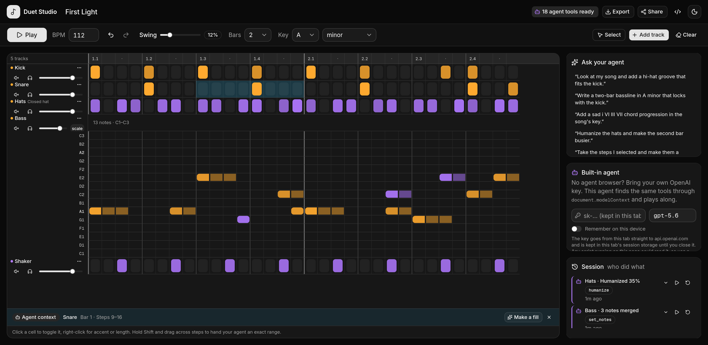

# Duet Studio

**A browser music studio where you and your AI agent produce a track together.**
Built for the [OpenAI WebMCP Challenge](https://webmcp.devpost.com/) (September 2026).

> Live demo: _coming soon_ · Demo video: _coming soon_



Duet Studio is a step sequencer and piano roll that runs entirely in the browser. Every part of the song — tempo, swing, tracks, drum hits, notes, mixer, transport — is exposed as a [WebMCP](https://webmachinelearning.github.io/webmcp/) tool on `document.modelContext`. Open it in ChatGPT's built-in browser (or Chrome with the WebMCP flag) and the agent can hear what you hear, write alongside you, and act on exactly the steps you point at.

## Why WebMCP fits

An agent cannot listen to audio, and it cannot reliably click a 32 × 12 grid of tiny cells. Both problems disappear with tools:

- **`get_song` gives the agent ears.** It returns the song as a compact text grid (`|X...x...X...x...|`, one line per track), so the model "sees" what the human is hearing and can reason about groove, density and harmony. Write tools answer with one line plus the track they touched, keeping every output well under Chrome's 1.5K-character guidance.
- **Write tools are musical, not mechanical.** `set_drum_pattern` takes a pattern string, `set_notes` takes note names and lengths, `humanize` adds velocity variation. One call replaces dozens of fragile clicks.
- **The human's pointer becomes context.** Shift-drag across steps and a new tool, `edit_selection`, appears (and disappears when the selection clears, via the `toolchange` lifecycle). "Make _these_ steps a snare fill" is now something an agent can do exactly.
- **Destructive actions stay human-gated.** `clear_song` opens an approve/decline dialog in the app and only proceeds if the human approves. The agent learns the outcome either way.
- **Every change is attributed.** Cells and notes are tinted by who wrote them (amber = you, violet = agent), and a session log shows each tool call with a one-click revert. Undo/redo covers both of you.

## What people and agents can do together

- You tap in a kick, the agent adds a hat groove that fits it, live, without stopping playback.
- The agent writes a bassline in the song's key with `get_scale_notes`; you drag a note somewhere unexpected; the agent reads the change and adapts the chords.
- You select the last four steps of a bar and say "fill", and the agent fills exactly that range.
- The agent proposes clearing a section; you decline; nothing changes.

## The tools

| Tool                                          | Kind           | What it does                                                                                                               |
| --------------------------------------------- | -------------- | -------------------------------------------------------------------------------------------------------------------------- |
| `get_song`                                    | read           | Full song as a text grid, transport state, human selection                                                                 |
| `list_instruments`                            | read           | Instrument ids, character, recommended pitch ranges                                                                        |
| `get_scale_notes`                             | read           | Notes of a scale within a range (music theory helper)                                                                      |
| `set_tempo`                                   | write          | BPM and swing                                                                                                              |
| `set_playback`                                | write          | Start/stop the loop (after the human has clicked once, per browser autoplay rules)                                         |
| `set_song_meta`                               | write          | Title, key, scale, bars (1/2/4)                                                                                            |
| `add_track` / `remove_track` / `update_track` | write          | Tracks and mixer (volume, mute, solo, rename)                                                                              |
| `set_drum_pattern`                            | write          | Replace a drum pattern (`X` accent, `x` hit, `o` soft, `.` rest), whole song or one bar                                    |
| `set_notes`                                   | write          | Write melodic notes (replace or merge), chords by stacking notes                                                           |
| `humanize`                                    | write          | Velocity variation on one or all tracks                                                                                    |
| `undo` / `redo`                               | write          | Shared history                                                                                                             |
| `clear_song`                                  | write, gated   | Requires human approval in the UI                                                                                          |
| `edit_selection`                              | write, dynamic | Only registered while the human has a selection: clear, transpose, scale velocity, set pattern/notes on exactly that range |

Read tools carry `readOnlyHint: true`. Every tool whose output can echo the song title or track names carries `untrustedContentHint: true`, because that text is typed by the human or arrives through share links. Bad input throws an actionable error (for example "No track matches 'nope'. Available: Kick (id …), …") which reaches the agent as an `isError` result.

## How it is built

- **Next.js 16** · **React 19** · **TypeScript** · **Tailwind 4** · **shadcn/ui**
- **Tone.js** drives the sequencer. It re-reads the song on every 16th note, so edits from either party are heard on the next step.
- **tonal** for music theory, **zustand + zundo** for state and undo history, **lz-string** for share links.
- **[`webmcp-types`](https://github.com/webmachinelearning/webmcp-types)** (the spec's official typings) types `document.modelContext`. Registration is ~40 lines of our own: each tool calls `registerTool(..., { signal })`, aborts the signal to unregister when the component unmounts or the tool's `when` condition flips, awaits the returned promise so `NotAllowedError` (permissions policy) surfaces as a toast, and forwards the host's `AbortSignal` into the tool so a cancelled `clear_song` closes its confirmation dialog.
- **Vercel AI SDK** (`ai` + `@ai-sdk/openai`) runs the built-in fallback agent's tool loop with `dynamicTool` definitions built from the discovered WebMCP tools.
- **[Vercel Web Analytics](https://vercel.com/docs/analytics)** (`@vercel/analytics`, cookie-free page views) is rendered only when the build runs on Vercel (`VERCEL=1`), so local production builds and the smoke tests never request the insights script.

Key files:

```
src/lib/webmcp/tools.ts              # every WebMCP tool: name, description, JSON schema, execute
src/components/studio/agent-tools.tsx # registers one tool per effect, abort = unregister
src/lib/webmcp/register.ts            # registerTool wrapper + MCP result shaping
src/lib/studio/store.ts               # zustand store; commit(actor, label, mutate) records provenance
src/lib/studio/engine.ts              # Tone.js engine
src/lib/studio/format.ts              # the text grid the agent reads
src/lib/webmcp/browser-agent.ts       # fallback agent: getTools() -> dynamicTool -> executeTool()
scripts/webmcp-smoke.mjs              # headless test that drives the real document.modelContext API
```

## Built to the WebMCP guidance

Before submission the project was audited line by line against the [WebMCP spec](https://webmachinelearning.github.io/webmcp/) and Chrome's [WebMCP](https://developer.chrome.com/docs/ai/webmcp), [secure tools](https://developer.chrome.com/docs/ai/webmcp/secure-tools), [best practices](https://developer.chrome.com/docs/ai/webmcp/best-practices) and [DevTools](https://developer.chrome.com/docs/devtools/application/webmcp) guides, and changed wherever it fell short. The measurable parts are asserted by `bun run smoke` on every run.

| Guidance                                                                                | Source         | What Duet Studio does                                                                                                                                                                                                                                 |
| --------------------------------------------------------------------------------------- | -------------- | ----------------------------------------------------------------------------------------------------------------------------------------------------------------------------------------------------------------------------------------------------- |
| `registerTool(tool, { signal })`, abort to unregister, handle the returned promise      | spec           | Own registration layer on the official `webmcp-types`; the promise is awaited, so `AbortError` from React remounts is ignored and `NotAllowedError` (permissions policy) surfaces as a toast instead of a false "registered"                          |
| Tools carry `title`, `description`, `inputSchema`, `annotations`                        | spec           | All 16 tools have a title; `readOnlyHint` on reads, `untrustedContentHint` on every tool that can echo human-typed text (song title, track names, anything arriving through a share link)                                                             |
| `execute` receives the host's `AbortSignal`                                             | spec           | Forwarded into the tool; a cancelled `clear_song` declines its own confirmation dialog                                                                                                                                                                |
| Register a tool only while it is useful                                                 | best practices | `edit_selection` exists only while the human has a selection and disappears with it                                                                                                                                                                   |
| Validate strictly in code, keep the schema advisory                                     | best practices | Every call passes `validateInput`: `bpm: "banana"` fails with `bpm must be a number, got "banana".` instead of being clamped to null. Share links and songs restored from localStorage go through the same zod parser and are repaired field by field |
| Fail with actionable errors, never a silent no-op                                       | best practices | Empty `update_track`, a drum track given `notes`, an unknown track: each throws a message that says what to do instead                                                                                                                                |
| Do not make the model do the arithmetic                                                 | best practices | `get_scale_notes`, pattern strings, `humanize`, selection-relative steps                                                                                                                                                                              |
| Budgets: name ≤ 30, description ≤ 500, parameter description ≤ 150, output ≤ 1.5K chars | secure tools   | Longest description 349 chars; `get_song` on the default song is 361 chars and `list_instruments` 744; write tools answer with one line plus the track they touched instead of re-describing the song                                                 |
| Treat user-generated content as untrusted, gate destructive actions                     | secure tools   | `untrustedContentHint` as above; `clear_song` proceeds only after the human approves in the UI                                                                                                                                                        |
| Inspect tools and invocations in DevTools                                               | DevTools       | Application → WebMCP shows titles, schemas, annotations and every call (see Test with an agent)                                                                                                                                                       |

**Where the shipping browser differs from the spec.** These were measured in Chromium 151 with the WebMCP feature on, and the code follows the browser today without blocking the spec tomorrow:

- `executeTool` needs its input as a JSON string; an object fails with "Failed to parse input arguments". The built-in agent sends a string and falls back to an object once if a host rejects it.
- `execute` receives an empty options object, no `signal`. Aborting `executeTool` rejects the caller but never reaches the tool, so the built-in agent declines any pending confirmation itself when you press Stop.
- `registerTool` returns a promise that rejects with `InvalidStateError` on a duplicate name and `AbortError` when the signal fires before registration settles. Awaiting it took the dev console from 15 unhandled rejections to 0.
- `getTools()` reports `title: ""` for tools registered without one, and the browser does not validate `inputSchema`. Hence titles everywhere and validation in code.
- ChatGPT's built-in browser documents `registerTool` only: no `EventTarget`, no `getTools`, no `executeTool`. Everything beyond `registerTool` is feature-checked, and `bun run smoke:hosts` simulates that host at load and injected late.

Not done yet: an Origin Trial token so Chrome 149+ stable works without the flag, and a scripted eval set along the lines of Chrome's [evals guide](https://developer.chrome.com/docs/ai/webmcp/evals).

## Run it

```bash
bun install
bun run dev        # http://localhost:3000
bun run build      # production build
```

### Test with an agent

- **ChatGPT desktop app**: open the URL in the built-in browser and pick **Site tools** in the address bar. Use GPT-5.6 Sol or Terra.
- **Chrome 149+**: enable `chrome://flags/#enable-webmcp-testing`, then use Gemini in Chrome or the [Model Context Tool Inspector](https://github.com/beaufortfrancois/model-context-tool-inspector) extension to call tools by hand.
- **Chrome DevTools**: open **Application → WebMCP** on the page. It lists every registered tool with its title, description, schema and annotations, logs each invocation with its input and output, and lets you run a tool by hand. Select a range in the grid and watch `edit_selection` appear in the list.
- **Headless smoke test**: `bun run smoke` (Chromium at `/usr/bin/chromium`, server at `http://localhost:3000/`; override with `CHROMIUM=…` and `SMOKE_URL=…`) registers the tools, calls them through `document.modelContext.executeTool`, and asserts registration, titles and annotations, validation errors, the selection-scoped tool, playback, the confirmation dialog, output sizes under 1.5K characters and a clean console. It exits non-zero on any failure and leaves a screenshot.
- **Host compatibility probe**: `bun run smoke:hosts` loads the page with a stand-in `document.modelContext` that only implements `registerTool` (no events, no `getTools`, the shape ChatGPT's built-in browser documents), once at load and once injected 2.5 s later, and checks that the studio renders and all tools register. `bun run smoke:all` runs both.

- **Built-in agent (no special browser needed)**: the sidebar has a fallback agent. Paste your own OpenAI API key and chat. The key is sent from the page straight to api.openai.com and kept in the tab's sessionStorage; it only goes to localStorage if you switch on "Remember on this device". Any script on the page could read it, so use a key with a spending limit and revoke it afterwards. It discovers the very same tools through `document.modelContext.getTools()` and invokes them with `executeTool()`, so it exercises the WebMCP path an external agent would; in a browser without WebMCP it calls the tool specs directly.

Without WebMCP the studio is still a complete, fully usable sequencer.

## License

MIT
